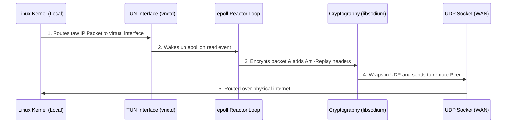

# Userspace L3 VPN Daemon (vnetd)

## Description
`vnetd` (Userspace L3 VPN Daemon) is a custom-built, lightweight vpn designed to securely route traffic over the internet using UDP. I built this from scratch in C to learn how modern VPNs work under the hood. 

Unlike VPN projects that can be millions of lines of code, `vnetd` strips everything back to the absolute essentials of high-performance packet routing. 

`vnetd` relies on the following concepts:
1. **Linux `epoll` Asynchronous Reactor**: A single-threaded event loop that handles thousands of connections without the overhead of context switching.
2. **Zero-Copy Memory Pools**: Using cache-line aligned (64-byte) ring buffers, it prevents unnecessary memory allocation and copying in the critical data path, keeping latency incredibly low.
3. **`libsodium` Cryptography**: It uses AEAD (Authenticated Encryption with Associated Data) using `chacha20poly1305`, alongside a 64-bit sliding window anti-replay mechanism to defend against malicious packet injections.

## Architecture Overview
Here's a quick look at how a packet flows through the daemon:



## Table of Contents
- [Prerequisites](#prerequisites)
- [Installation & Build Instructions](#installation--build-instructions)
- [Usage & Running](#usage--running)
- [Running the Test Suite](#running-the-test-suite)
- [Future Improvements](#future-improvements)
- [Author & Contact](#author--contact)

## Prerequisites
Before running or building this project, ensure you have the following installed on your system:
- **Linux** (kernel supporting TUN/TAP interfaces, `/dev/net/tun`)
- **CMake** (v3.10+)
- **GCC / Clang** (C11 standard support)
- **libsodium** (for cryptographic routines)
- **Nix** (Optional, but highly recommended for a reproducible development environment via `shell.nix`)

## Installation & Build Instructions
The project is built using CMake. To build it from source:

1. **Clone the repository**:
   ```bash
   git clone https://github.com/cshah25/VPN-Daemon.git
   cd "VPN-Daemon"
   ```

2. **(Optional) Enter the Nix shell**:
   ```bash
   nix-shell
   ```

3. **Build the daemon**:
   ```bash
   mkdir -p build && cd build
   cmake ..
   make
   ```
   This will output the `vnetd` executable inside the `build/` directory.

## Usage & Running
The daemon requires `root` privileges (or `CAP_NET_ADMIN`) to allocate the TUN interface and configure network routing. 

**Basic Usage:**
```bash
sudo ./build/vnetd <tun_name> <bind_port> <remote_ip> <remote_port>
```

**Example:**
To establish a tunnel over UDP port `8200` to a remote peer at `10.0.1.2:8200`:
```bash
# Start the daemon
sudo ./build/vnetd tun0 8200 10.0.1.2 8200 &

# Configure the virtual IP address for the VPN interface
sudo ip addr add 192.168.2.1/24 dev tun0
sudo ip link set dev tun0 up
```

## Running the Test Suite
The repository includes an automated end-to-end integration test utilizing **Linux Network Namespaces**. This script spins up two isolated instances of `vnetd`, creates a virtual network link between them, configures the tunnel, and tests ICMP connectivity.

To run the automated tests:
```bash
sudo ./test_tunnel.sh
```
A successful test will display logs of encapsulated packets and a zero percent packet loss ping report.

### File Structure

```text
src/
├── main.c       - Application entry point; initializes subsystems and ties everything together.
├── tun.c/.h     - Allocates and configures the virtual TUN network interface with the Linux kernel.
├── udp.c/.h     - Manages the underlying UDP sockets used for WAN transport, including SO_MARK routing.
├── reactor.c/.h - The core asynchronous `epoll` event loop for non-blocking I/O multiplexing.
├── buffer.c/.h  - Implements the zero-copy, cache-line aligned ring buffer memory pool for packets.
├── packet.c/.h  - Utilities for parsing and validating IPv4 packet headers.
├── mtu.c/.h     - In-line TCP MSS (Maximum Segment Size) clamping to prevent IP fragmentation.
├── crypto.c/.h  - Wraps `libsodium` to provide high-level `chacha20poly1305` AEAD encryption.
├── replay.c/.h  - The 64-bit sliding window anti-replay mechanism that tracks packet sequence numbers.
├── protocol.h   - Defines the raw, unencrypted 16-byte binary wire protocol header format.
├── peer.c/.h    - Tracks active VPN sessions, allowed IPs, and symmetric encryption keys per peer.
├── handshake.c/.h - Implements the Noise-like Ephemeral Diffie-Hellman cryptographic handshake.
├── timers.c/.h  - Manages active keep-alive heartbeats and tracks peer roaming/timeouts.
├── route.c/.h   - System utilities for modifying the host Linux routing table via Netlink.
└── system.c/.h  - Security functions for daemonizing the process and dropping root privileges.
```

## Future Improvements
The underlying architecture is complete, but several advanced features are planned for future development:
- **Full Control Plane**: Finish integration of the Ephemeral Diffie-Hellman handshake for dynamic key negotiation.
- **Dynamic Roaming**: Implement active keep-alive heartbeats to support peers changing IP addresses (e.g., switching from Wi-Fi to cellular).
- **Multithreading**: Scale the `epoll` reactor across multiple threads to handle thousands of concurrent peers.
- **Netlink Routing**: Flesh out the `route.c` module to automatically add and remove IP routes in the Linux kernel table upon peer connection.

## Author & Contact
- **Author**: Chirayu Shah
- **Contact**: chirayu@chirayushah.com
